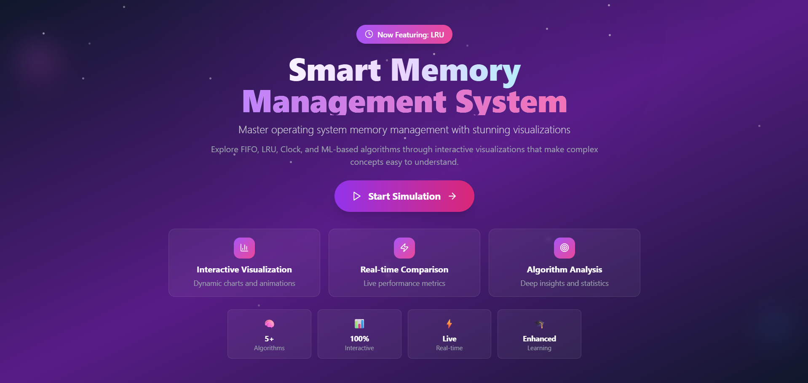

# Page Replacement Algorithm Simulator 🧠

An interactive web application for visualizing and comparing page replacement algorithms used in operating systems memory management. This educational tool provides real-time visualizations, comprehensive analytics, and side-by-side algorithm comparisons to help students and professionals understand memory management concepts.



## 🚀 Features

### 🎯 Interactive Visualizations
- **Real-time Algorithm Execution**: Watch algorithms process page references step-by-step
- **Color-coded Memory Frames**: Visual representation of memory state changes
- **Animation Controls**: Play, pause, step forward/backward through execution
- **Performance Indicators**: Live fault rates, hit rates, and efficiency metrics

### 📊 Algorithm Support
- **FIFO (First In, First Out)**: Classic queue-based replacement
- **LRU (Least Recently Used)**: Optimal for temporal locality
- **Clock Algorithm**: Second-chance implementation with reference bits
- **Adaptive Algorithm**: Dynamic switching between FIFO and LRU
- **ML-Based Prediction**: Machine learning inspired replacement strategy

### 🔍 Comprehensive Analysis
- **Side-by-side Comparisons**: Compare all algorithms simultaneously
- **Performance Metrics**: Page faults, fault rates, hit rates, efficiency
- **Statistical Analysis**: Generation statistics for random page strings
- **Export Capabilities**: Copy results as formatted text reports

### 🛠️ Advanced Configuration
- **Custom Page Strings**: Input your own page reference sequences
- **Random Generation**: Generate realistic page reference patterns
- **Preset Scenarios**: Quick-start with common test cases
- **Frame Size Control**: Test with different memory configurations (1-10 frames)

## 🎨 Screenshots

### Hero Landing Page
Beautiful gradient background with interactive algorithm showcase and smooth animations.

### Algorithm Visualization

*Real-time algorithm execution with color-coded frames and performance metrics*

### Performance Comparison

*Interactive charts comparing algorithm performance across multiple metrics*

### Configuration Setup

*Intuitive configuration interface with validation and presets*

## 🏗️ Technology Stack

### Frontend
- **React 18**: Modern component-based architecture
- **Tailwind CSS**: Utility-first styling with custom gradients
- **Chart.js**: Interactive performance visualizations
- **Lucide React**: Beautiful, consistent icons
- **Vite**: Fast development and building

### Features & Libraries
- **Responsive Design**: Mobile-first approach with breakpoint optimization
- **Smooth Animations**: CSS transitions and transforms
- **Keyboard Shortcuts**: Power-user navigation (Ctrl+1,2,3 for tabs)
- **Real-time Updates**: Live performance calculations
- **Export Functions**: Clipboard API integration

### Architecture
```
src/
├── components/          # React components
│   ├── Hero.jsx        # Landing page
│   ├── SetupForm.jsx   # Configuration interface
│   ├── VisualizationDisplay.jsx  # Algorithm execution
│   └── ComparisonChart.jsx       # Performance analysis
├── algorithms/         # Algorithm implementations
│   ├── FIFO.js        # First In, First Out
│   ├── LRU.js         # Least Recently Used
│   ├── Clock.js       # Clock algorithm
│   ├── Adaptive.js    # Adaptive algorithm
│   ├── MLPageReplacement.js  # ML-based algorithm
│   └── simulationRunner.js  # Execution engine
└── styles/            # CSS and styling
```

## 🚀 Quick Start

### Prerequisites
- **Node.js** (v16 or higher)
- **npm** or **yarn**

### Installation

1. **Clone the repository**
```bash
git clone https://github.com/yourusername/page-replacement-simulator.git
cd page-replacement-simulator
```

2. **Install dependencies**
```bash
npm install
# or
yarn install
```

3. **Start development server**
```bash
npm run dev
# or
yarn dev
```

4. **Open your browser**
Navigate to `http://localhost:5173`

### Building for Production
```bash
npm run build
# or
yarn build
```

## 📚 Usage Guide

### Getting Started
1. **Launch the Application**: Click "Start Simulation" from the hero page
2. **Configure Parameters**: 
   - Enter a page reference string (e.g., "1,2,3,4,1,2,5")
   - Set frame size (1-10)
   - Choose algorithm
3. **Run Simulation**: Click "Run Simulation" or "Compare All Algorithms"
4. **Analyze Results**: Use controls to step through execution or view comparisons

### Page Reference Strings
- **Format**: Comma-separated integers (e.g., "1,2,3,4,1,2,5,1,2,3,4,5")
- **Range**: Any non-negative integers
- **Length**: 3-100 pages supported
- **Examples**:
  - Small test: `1,2,3,4,1,2,5,1,2,3,4,5`
  - Locality pattern: `1,1,1,2,2,2,3,3,3,1,1,1`
  - Random access: `9,3,7,1,5,8,2,6,4,9,1,3`

### Keyboard Shortcuts
- **Ctrl+1**: Switch to Setup tab
- **Ctrl+2**: Switch to Visualization tab
- **Ctrl+3**: Switch to Comparison tab
- **Ctrl+H**: Return to home page
- **Space**: Toggle autoplay (in visualization)

## 🔧 Configuration Options

### Frame Size
- **Range**: 1-10 frames
- **Impact**: Smaller frames = higher fault rates
- **Recommendation**: Start with 3-4 frames for educational purposes

### Random Generation
- **Pages**: 5-100 total pages
- **Range**: 1-50 unique page values
- **Patterns**: Configurable for different locality behaviors

### Algorithm Parameters
- **FIFO**: No additional parameters
- **LRU**: Tracks access history automatically
- **Clock**: Uses reference bits (displayed during execution)
- **Adaptive**: Switches based on pattern detection
- **ML-Based**: Currently implements LRU-like behavior

## 📈 Performance Metrics

### Key Metrics
- **Page Faults**: Total number of page misses
- **Fault Rate**: Percentage of page accesses resulting in faults
- **Hit Rate**: Percentage of page accesses found in memory
- **Efficiency**: Overall algorithm performance score

### Comparison Features
- **Visual Charts**: Bar charts with interactive tooltips
- **Statistical Summary**: Best/worst performer identification
- **Export Options**: Copy formatted results to clipboard
- **Detailed Breakdown**: Frame-by-frame analysis

## 🎓 Educational Use

### Learning Objectives
- **Understand Memory Management**: Visualize how operating systems manage memory
- **Compare Algorithm Trade-offs**: See performance differences in real-time
- **Analyze Access Patterns**: Understand locality of reference impact
- **Optimize Memory Usage**: Learn when to use different algorithms

### Classroom Integration
- **Interactive Demonstrations**: Live algorithm walkthroughs
- **Assignment Tool**: Students can test custom scenarios
- **Performance Analysis**: Compare theoretical vs. practical results
- **Research Projects**: Explore advanced replacement strategies

## 🤝 Contributing

We welcome contributions! Please see our [Contributing Guidelines](CONTRIBUTING.md) for details.

### Development Setup
1. Fork the repository
2. Create a feature branch: `git checkout -b feature/amazing-feature`
3. Make changes and test thoroughly
4. Commit with clear messages: `git commit -m 'Add amazing feature'`
5. Push to branch: `git push origin feature/amazing-feature`
6. Open a Pull Request

### Areas for Contribution
- **New Algorithms**: Implement additional replacement strategies
- **UI Improvements**: Enhance user experience and accessibility
- **Performance Optimizations**: Improve simulation speed
- **Educational Content**: Add tutorials and explanations
- **Testing**: Expand test coverage and validation

## 📄 License

This project is licensed under the MIT License - see the [LICENSE](LICENSE) file for details.

## 🙏 Acknowledgments

- **Operating Systems Concepts** by Silberschatz, Galvin, and Gagne
- **React Community** for excellent documentation and tools
- **Tailwind CSS** for making beautiful designs accessible
- **Chart.js** for powerful, flexible charting capabilities

## 🗺️ Roadmap

### Upcoming Features
- [ ] **Additional Algorithms**: Optimal (Belady's), Second Chance, Enhanced Second Chance
- [ ] **Advanced Analytics**: Heat maps, access pattern analysis
- [ ] **Export Options**: PDF reports, CSV data export
- [ ] **Accessibility**: Screen reader support, keyboard navigation
- [ ] **Mobile Optimization**: Touch-friendly controls, responsive charts
- [ ] **Internationalization**: Multi-language support
- [ ] **Real ML Integration**: Actual machine learning prediction models


---

**Built with ❤️ for the Operating Systems community**

*This project is part of the Operating Systems Laboratory curriculum and is designed to make complex memory management concepts accessible through interactive visualization.*
